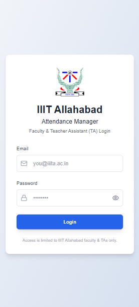
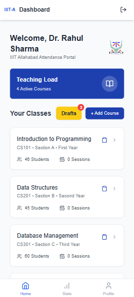
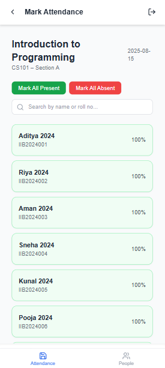
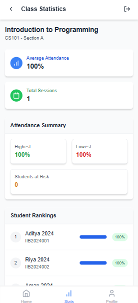
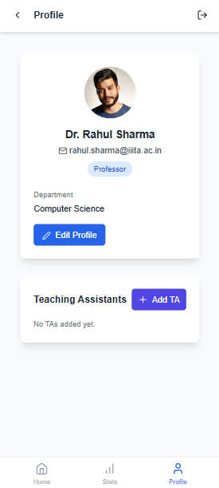

# 📘 MarkMe — Attendance Management System (Frontend)

React + Vite + Zustand frontend for professor attendance management. Connects to backend API for persistent data.

---

## 🔹 Project Information
- **Project Name:** MarkMe — Attendance Management System (Frontend)  
- **Course / Subject:** IT-BI  
- **Objective:** Digitalize attendance management system for colleges, enabling professors and assistants to take, save, and analyze attendance efficiently.  

---

## 🌐 Live Demo
👉 [MarkMe App](https://mark-me-eta.vercel.app)  

---

## ✨ Features
- Professor login & authentication  
- Dashboard with courses, today’s classes & quick stats  
- Mark attendance (present/absent)  
- Save attendance as **drafts**  
- Add/remove courses  
- Add **Teacher Assistants** to help in taking attendance  
- View & export attendance reports (CSV/Excel)  
- Get statistics & insights of attendance  
- Responsive design — works on desktop and mobile  

---

## 📄 Pages / App Screens
- **LoginPage.tsx / LoginPage.css** — professor login  
- **DashboardPage.tsx** — overview of courses & classes  
- **AttendancePage.tsx** — mark and save attendance  
- **ClassStatsPage.tsx** — course-wise statistics  
- **ProfilePage.tsx** — user settings & logout  
- **StatsRedirect.tsx** — redirect to stats view  

---

## 📸 Screenshots

### 🔑 Login Page


### 📊 Dashboard


### ✅ Attendance Page


### 📈 Class Stats


### 👤 Profile Page



---

## ⚙️ How to Run (Dev)

### Prerequisites
- Node.js (v16+ recommended)  
- npm or yarn  
- Backend running (or mock server)  

### Commands
```bash
# clone the repository
git clone https://github.com/rutwikhere/MarkMe
cd MarkMe

# install dependencies
npm install

# start dev server
npm run dev

# build for production
npm run build
